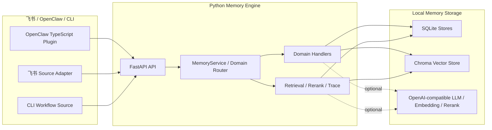

# LarkMemory

> 飞书 AI 比赛 OpenClaw 赛道下的企业级长程协作 Memory 系统。


LarkMemory 解决企业跨部门协作里的“智能体失忆”问题：项目群聊里的历史决策、文档里的长期事实、会议后的待办和团队需要反复记住的知识，都可以被抽取为可检索、可更新、可遗忘、可主动推送的长期记忆。

当前项目采用 **OpenClaw TypeScript 插件 + 本地 Python Memory Engine 后端服务** 的旁路架构。插件负责接入 OpenClaw 和飞书生态，Python Memory Engine 负责记忆的提取、存储、检索、更新、遗忘和主动服务。

## 目录

- [核心能力](#核心能力)
- [系统架构](#系统架构)
- [当前进度](#当前进度)
- [快速开始](#快速开始)
- [手工 Demo](#手工-demo)
- [主要 API](#主要-api)
- [常用环境变量](#常用环境变量)
- [项目结构](#项目结构)
- [当前边界](#当前边界)

## 核心能力

| 能力 | 当前实现 |
| --- | --- |
| 标准化事件接入 | `NormalizedEvent` 统一接收聊天、文档、会议、任务、日历、CLI 等上下文 |
| 记忆抽取 | 支持规则抽取和可选 OpenAI-compatible LLM 抽取 |
| 统一记忆模型 | `MemoryCore` 保存通用元数据、生命周期、实体、标签、置信度和重要性 |
| 领域记忆 | 已实现 `project_decision`、`team_retention`、`cli_workflow`，预留 `personal_preference` |
| 检索与排序 | 支持关键词、领域路由、Embedding、ChromaDB、HTTP Rerank 和 trace |
| 更新与遗忘 | 支持 expire、forget、supersede、confidence、importance、feedback、reviewed、snooze |
| 主动服务 | 支持团队保留记忆复习提醒和飞书互动卡片回调 |
| 评测支撑 | 已保留 benchmark 资源与评测 runner 方向，面向自证评测报告扩展 |

## 系统架构



核心链路：

1. 外部上下文被标准化为 `NormalizedEvent`。
2. `MemoryService` 根据事件和查询进行领域路由。
3. 领域 handler 抽取结构化记忆，并写入 `MemoryCore` 与领域 store。
4. 检索时按 query、scope、domain、状态和时间召回 active memory。
5. 记忆可被覆盖、过期、遗忘或通过反馈强化。
6. 主动服务根据复习计划或相关上下文生成飞书卡片和建议。

## 当前进度

已跑通的主线能力：

- Python Memory Engine 的 ingest、retrieve、update、health、proactive API。
- 项目决策记忆：从群聊或文档中抽取决策、理由、备选方案和结论。
- 团队保留记忆：长期事实、风险、提醒、复习计划、遗忘曲线和版本覆盖。
- CLI 工作流记忆：记录项目上下文中的命令模板、参数绑定和执行反馈。
- 飞书 Source Adapter：消息、卡片交互、日历、任务、妙记、文档变更事件接入。
- LLM / Embedding / Rerank：支持 OpenAI-compatible provider、ChromaDB 和 HTTP rerank。
- 本地配置：`larkmemory.env` 自动加载，真实配置默认不提交。

比赛交付物方向：

- Memory 定义与架构白皮书。
- 可运行 Demo。
- 自证评测报告。

## 快速开始

### 1. 准备环境

建议使用 Python 3.11+，项目使用 `uv` 管理本地环境和依赖。

```bash
uv venv
uv pip install -r requirements.txt
```

### 2. 配置服务

仓库提供 `larkmemory.env.example` 作为模板。推荐复制为本地配置文件后按需修改：

```bash
cp larkmemory.env.example larkmemory.env
```

Windows PowerShell：

```powershell
Copy-Item larkmemory.env.example larkmemory.env
```

默认服务地址为 `127.0.0.1:8765`，默认 SQLite 路径为 `.larkmemory/larkmemory.db`。

### 3. 启动后端

```bash
uv run uvicorn src.app.main:app --host 127.0.0.1 --port 8765
```

Windows PowerShell 如需显式指定配置文件：

```powershell
$env:LARKMEMORY_CONFIG_FILE=".\larkmemory.env"
uv run uvicorn src.app.main:app --host 127.0.0.1 --port 8765
```

Linux / macOS：

```bash
export LARKMEMORY_CONFIG_FILE=./larkmemory.env
uv run uvicorn src.app.main:app --host 127.0.0.1 --port 8765
```

### 4. 运行测试

```bash
uv run pytest -q
uv run python -m compileall src tests
```

## 手工 Demo

### 健康检查

```bash
curl http://127.0.0.1:8765/health
```

### 写入项目决策

```bash
curl -X POST http://127.0.0.1:8765/api/v1/ingest \
  -H 'Content-Type: application/json; charset=utf-8' \
  -d '{
    "event_id": "demo-event-1",
    "event_type": "chat_message",
    "source_type": "feishu_chat",
    "occurred_at": "2026-04-27T00:00:00Z",
    "context": {
      "project_id": "project-demo",
      "team_id": "team-demo"
    },
    "content_text": "我们决定采用方案 B 而不是方案 A，因为接入成本更低"
  }'
```

期望响应包含：

```json
{
  "status": "ok",
  "stored": true,
  "memory_candidates": 1
}
```

### 检索历史决策

```bash
curl -X POST http://127.0.0.1:8765/api/v1/retrieve \
  -H 'Content-Type: application/json; charset=utf-8' \
  -d '{
    "query_text": "方案 B",
    "project_id": "project-demo",
    "top_k": 1,
    "include_trace": true
  }'
```

期望响应中 `results[0].domain` 为 `project_decision`。

### 更新记忆状态

```bash
curl -X POST http://127.0.0.1:8765/api/v1/update \
  -H 'Content-Type: application/json; charset=utf-8' \
  -d '{
    "memory_id": "memory-id-from-retrieve",
    "action": "feedback",
    "feedback": "useful"
  }'
```

### 查看主动提醒

```bash
curl "http://127.0.0.1:8765/api/v1/proactive?project_id=project-demo&team_id=team-demo"
```

## 主要 API

| API | 说明 |
| --- | --- |
| `GET /health` | 检查服务和本地存储状态 |
| `POST /api/v1/ingest` | 写入标准化事件，并生成长期记忆候选 |
| `POST /api/v1/retrieve` | 检索长期记忆 |
| `POST /api/v1/memories/search` | 检索别名 |
| `POST /api/v1/update` | 更新记忆状态、分数或反馈 |
| `POST /api/v1/memories/update` | 更新别名 |
| `GET /api/v1/proactive` | 返回主动推送建议和复习提醒 |
| `POST /api/v1/embeddings` | 单条 embedding API |
| `POST /api/v1/embeddings/batch` | 批量 embedding API |
| `POST /api/v1/rerank` | HTTP rerank API |

## 常用环境变量

| 变量 | 默认值 | 说明 |
| --- | --- | --- |
| `LARKMEMORY_HOST` | `127.0.0.1` | 服务监听地址 |
| `LARKMEMORY_PORT` | `8765` | 服务端口 |
| `LARKMEMORY_API_BASE` | `http://127.0.0.1:8765` | 客户端访问后端的基础地址 |
| `LARKMEMORY_DATA_DIR` | `.larkmemory` | 本地数据目录 |
| `LARKMEMORY_SQLITE_PATH` | `.larkmemory/larkmemory.db` | SQLite 数据库路径 |
| `LARKMEMORY_CHROMA_DIR` | `.larkmemory/chroma` | ChromaDB 本地目录 |
| `LARKMEMORY_ENABLE_LLM` | `false` | 是否启用 LLM 抽取 |
| `LARKMEMORY_LLM_API_KEY` | 空 | OpenAI-compatible LLM API key |
| `LARKMEMORY_LLM_MODEL` | 空 | LLM 模型名 |
| `LARKMEMORY_LLM_BASE_URL` | 空 | LLM 服务地址 |
| `LARKMEMORY_ENABLE_EMBEDDING` | `false` | 是否启用 embedding |
| `LARKMEMORY_ENABLE_VECTOR_STORE` | `true` | 是否启用向量存储 |
| `LARKMEMORY_ENABLE_RERANK` | `false` | 是否启用 rerank |
| `LARKMEMORY_ENABLE_PROACTIVE_PUSH` | `false` | 是否启用主动推送 |
| `LARKMEMORY_FEISHU_ENABLE_WS` | `false` | 是否启用飞书 WebSocket listener |
| `LARKMEMORY_LOG_LEVEL` | `INFO` | 日志级别 |

更多配置见 [`larkmemory.env.example`](./larkmemory.env.example)。

## 项目结构

```text
LarkMemory/
├── plugin/                 # OpenClaw TypeScript 插件
├── src/
│   ├── app/                # FastAPI 应用、配置和依赖注入
│   ├── api/                # HTTP API 路由
│   ├── core/               # MemoryService、领域路由、生命周期编排
│   ├── domains/            # project_decision / team_retention / cli_workflow 等领域记忆
│   ├── llm/                # LLM、Embedding、Rerank provider
│   ├── retrieval/          # 查询理解、召回、融合、重排和 trace
│   ├── schemas/            # NormalizedEvent、MemoryCore、API schema
│   ├── sources/            # 飞书、CLI 等 source adapter
│   └── storage/            # SQLite、Chroma、领域 store
├── tests/                  # pytest 单元测试
├── benchmark/              # 评测相关资源
├── docs/                   # 设计文档和交付文档
├── memory-bank/            # 项目长期上下文、架构和进度记录
├── larkmemory.env.example  # 本地配置模板
└── pyproject.toml
```

## 当前边界

- 当前阶段优先保证本地可运行 Demo 和评测闭环。
- 暂不做云端服务。
- 暂不做完整 UI。
- 暂不做生产级认证权限。
- 飞书真实接入需要配置应用凭证，并按飞书平台权限开通相应事件。

## 文档

- [`memory-bank/prd.md`](./memory-bank/prd.md)：项目需求和比赛目标。
- [`memory-bank/architecture.md`](./memory-bank/architecture.md)：系统架构、模块分层和数据流。
- [`memory-bank/implementation-plan.md`](./memory-bank/implementation-plan.md)：阶段性实施计划。
- [`memory-bank/progress.md`](./memory-bank/progress.md)：开发进度记录。
